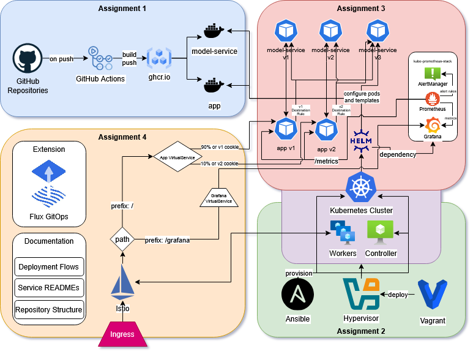

# SMS Checker – Project Overview & Repository Guide

This repository (**operation**) serves as the main entry point for the **SMS Checker** project.
The project is organized as a set of independent components that communicate via REST APIs. Each component is developed in its own repository and released independently. Over the course of the project, the architecture evolved from a minimal prototype into a containerized system with Kubernetes, ingress, service mesh, and monitoring support.



---

## Repository Structure

The organization consists of the following repositories:

| Component         | Description                                | Repository                                                                                           |
| ----------------- | ------------------------------------------ | ---------------------------------------------------------------------------------------------------- |
| **operation**     | Infrastructure, deployment, and operations | [https://github.com/doda2025-team20/operation/tree/a4](https://github.com/doda2025-team20/operation/tree/a4)         |
| **model-service** | Backend ML inference service               | [https://github.com/doda2025-team20/model-service/tree/a4](https://github.com/doda2025-team20/model-service/tree/a4) |
| **app**           | Frontend application and API gateway       | [https://github.com/doda2025-team20/app/tree/a4](https://github.com/doda2025-team20/app/tree/a4)                     |
| **lib-version**   | Version-aware shared library               | [https://github.com/doda2025-team20/lib-version/tree/a4](https://github.com/doda2025-team20/lib-version/tree/a4)     |

Each component is built, versioned, and deployed independently.

---

## Project Context

The SMS Checker application initially consisted of a simple HTML/JavaScript frontend connected to a trivial backend.
Early versions served the frontend via Spring Boot, using an API gateway to forward requests to the model service and avoid cross-site scripting issues.

Throughout the course, the system was extended to:

* run all components as standalone container images
* communicate exclusively via REST APIs or shared versioned libraries
* support both local execution (Docker Compose) and Kubernetes-based deployment
* include ingress, traffic management, and monitoring

---

## Local Development (Docker Compose)

For local development and testing, the entire system can be started using Docker Compose.

### Prerequisites

* Docker
* Docker Compose

### Running the application

```bash
docker compose up -d
```

### Accessing the application

* **SMS Checker**: [http://localhost:8080/sms](http://localhost:8080/sms)
* **About page (lib-version info)**: [http://localhost:8080/about](http://localhost:8080/about)

### Configuration (`.env`)

The deployment is configurable via the `.env` file:

| Variable        | Default                                        | Description          |
| --------------- | ---------------------------------------------- | -------------------- |
| `APP_IMAGE`     | `ghcr.io/doda2025-team20/app:latest`           | Frontend image       |
| `MODEL_IMAGE`   | `ghcr.io/doda2025-team20/model-service:latest` | Backend image        |
| `APP_PORT`      | `8080`                                         | App container port   |
| `MODEL_PORT`    | `8081`                                         | Model container port |
| `HOST_APP_PORT` | `8080`                                         | Host port            |
| `MODEL_HOST`    | `http://model-service:8081`                    | App -> model routing  |
| `MODEL_URL`     | latest release                                 | Model download URL   |
| `DEBUG`         | `false`                                        | Flask debug mode     |

### Volumes

| Service       | Mapping                | Purpose                 |
| ------------- | ---------------------- | ----------------------- |
| model-service | `./output:/sms/output` | Persisted model storage |

---

### Cluster Provisioning (Vagrant + Ansible)

To provision a Kubernetes cluster locally using virtual machines:

```bash
cd infra
vagrant up
```

This creates:

* one control-plane node
* two worker nodes

After this is finished, you need to get the proper tools and then run the `finalization.yaml` playbook in order to set up **MetalLB** load balancer and **Ingress**. Before that make sure you have the `community.kubernetes` collection installed:

```bash
ansible-galaxy collection install community.kubernetes
```

After that is done, we run `finalization.yaml` to set up MetalLB and Ingress:

```bash
ansible-playbook -i .vagrant/provisioners/ansible/inventory/vagrant_ansible_inventory playbooks/finalization.yaml
```

All Kubernetes tooling, access instructions, and operational details are documented here:

* **Cluster services & tooling** -> [`infra/k8s/README.md`](./infra/k8s/README.md)

---

## Kubernetes Application Deployment (Helm)

The SMS Checker application is deployed to Kubernetes using a **single Helm chart** located in `helm-chart/`.

### What the Helm chart installs

* App and model Deployments and Services
* Istio Gateway, VirtualServices, and DestinationRules
* Prometheus `ServiceMonitor` resources
* Prometheus alert rules
* Grafana with pre-provisioned dashboards and datasources
* Secrets and ConfigMaps for configuration

Detailed Helm usage, prerequisites, and verification steps are documented here:

* **Helm chart, monitoring & dashboards** -> [`helm-chart/README.md`](./helm-chart/README.md)

---

## Accessing the Application via Ingress

### Istio Ingress (Kubernetes)

After installing Istio and deploying the Helm chart:

```bash
kubectl get svc -n istio-system istio-ingressgateway
```

Retrieve the external IP or port (depending on environment).

#### Minikube

```bash
minikube service istio-ingressgateway -n istio-system --url
```

Then access:

```
http://<INGRESS_ADDRESS>/sms
```

Metrics are available at:

```
http://<INGRESS_ADDRESS>/metrics
```

---

## Monitoring: Prometheus & Grafana

Monitoring is deployed as part of the Helm chart.

### Prometheus

* Scrapes metrics exposed by both app and model services
* Uses `ServiceMonitor` resources
* Includes alert rules

Example metrics:

* `sms_requests_total`
* `sms_last_confidence`
* `sms_request_duration_seconds`

### Grafana

* Automatically provisioned dashboards
* Prometheus datasource configured via ConfigMaps

Access instructions and dashboard descriptions are available in:

* `helm-chart/README.md`

---

## Additional Documentation

* **Team activity log**: `ACTIVITY.md`

---

## Ongoing Evolution

The repository layout and startup procedures will be updated as the architectural extensions are introduced.
This README will be maintained to reflect those changes.
