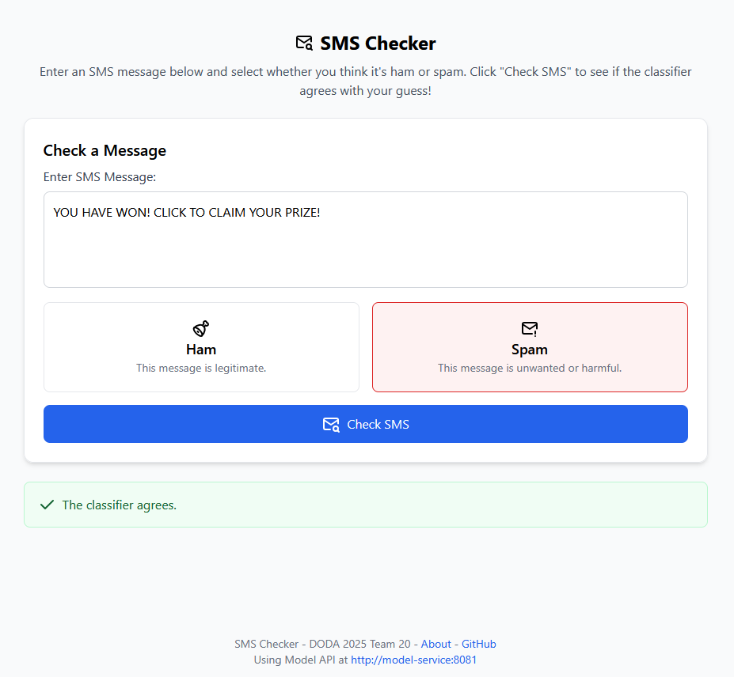
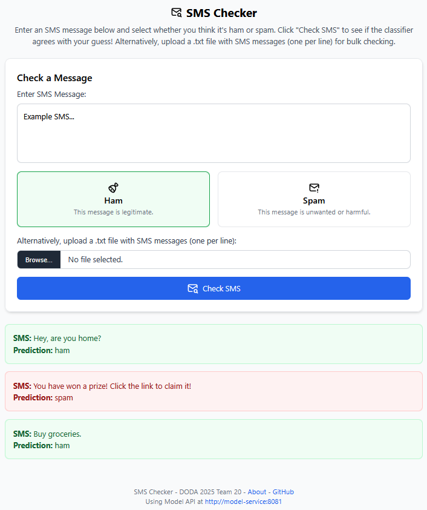
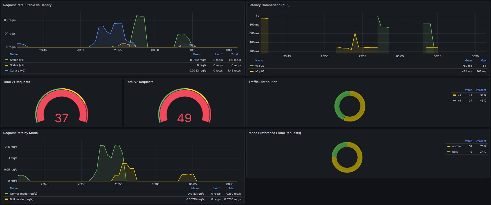

# Continuous Experimentation

## New Feature Proposal
For our approach to continuous experimentation, we leverage Kubernetes and Istio with the Traffic Management features the latter provides, to apply A/B testing and a canary release on a new feature of our app. This feature involves bulk classification functionality that offers a new UI option where users can upload a file of new-line-separated texts to be classified in one go, receiving results for all of them at once. Our new feature also comes with a new version of the underlying classification service, which now offers a specific batch processing endpoint, which loads the model and other required resources more efficiently for bulk requests.

## Experiment Setup
For our experiment, we have extended the existing application and model service versions to include the new bulk classification feature.

|  |  |
|:-------------------------:|:-------------------------:|
| Release Version - No Bulk Classification | Canary Version - With Batch Processing |

Istio is configured to route a small percentage (by default 10%) of user traffic to the canary version (v2) of the application, with the majority (90%) going to the stable version (v1). Traffic management ensures that users hitting one pod within a version will stay in that pod, and version stickiness can also be achieved by setting the `canary` cookie to `v1` or `v2` respectively (automatically setting this cookie has not been implemented to allow users to easily switch between versions, however manually setting the cookie will force routing to the desired version). To ensure the new feature is available only to users routed to the canary version of the UI, Istio has been configured to tag and route traffic from UI `v1` only to model service `v1`, and traffic from UI `v2` only to model service `v2` (in addition to a shadow-launched `v3`, if applicable). All aforementioned functionality is provided in the Helm chart, and is enabled by default.

## Experiment Hypothesis
We hypothesize that the new bulk classification feature will enhance user experience by allowing users to classify multiple texts in a single request, improving efficiency. We expect that the number of messages processed in bulk will be much higher than individual classifications over time, as well as a higher request rate for bulk classifications. We will measure the success of this hypothesis through feature usage metrics, namely the number of classifications made through the bulk feature compared to individual classifications, as well as the rate of usage of each mode over time. To ensure result cleanliness, these metrics will only be collected from `v2` users, not to pollute individual classification metrics with `v1` users.

The metrics are exposed by the user interface as `sms_request_mode_total` with possible values either `normal` or `bulk`, and aggregated by Prometheus. A special experimentation Grafana dashboard is implemented, aggregating metrics from Istio regarding the rate of requests and latency to each version, the total number of requests to each version, as well as the bulk vs normal classification metrics from the UI.

## Experiment Validation
To validate our hypothesis, our application would be released to a general audience of users, with both versions being active for a period of two weeks. The sticky session cookie would be automatically set by the application to ensure users remain on the same version throughout the experiment duration. During this period, we would monitor the defined metrics closely using the Grafana dashboard, closely monitoring the rate of adoption of the new bulk classification feature among users routed to the canary version. We would also be monitoring the Istio traffic management metrics to ensure traffic distribution and version stickiness behave as expected, maintaining the integrity of the experiment. At the end of the experiment, we would expect widespread use of the bulk classification feature, seeing a significant portion of total classifications being made through this new mode. If this is the case, our hypothesis would be considered successful, and we would proceed to fully roll out the new feature to all users by promoting the canary version to stable.

On the contrary, if the bulk classification feature sees minimal adoption or does not have the expected impact on user experience, we would pivot to collecting user feedback and consulting user experience professionals to assist in refining the visibility and usefulness of the feature.